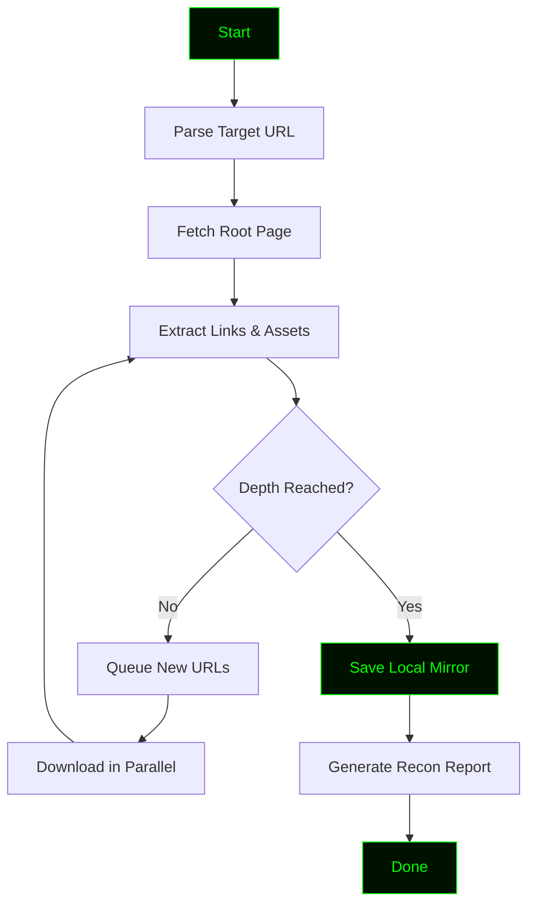

# httrack
<!-- ═══════════════════════════════════════════════════════════════════════ -->
<!--                        HTTPRACK - README.md                             -->
<!--              Professional Bug Bounty Recon Documentation                -->
<!-- ═══════════════════════════════════════════════════════════════════════ -->

<div align="center">

<!-- Animated Header Banner -->


<!-- Typing Animation -->


<br>

<!-- Status Badges -->
<p>


</p>

<p>


</p>

<br>

<!-- Matrix Rain GIF -->


</div>

---

<div align="center">

<!-- ═══════════════════════════════════════════════════════════════════════ -->
<!--                        HTTPRACK - README.md                             -->
<!--              Professional Bug Bounty Recon Documentation                -->
<!-- ═══════════════════════════════════════════════════════════════════════ -->

<div align="center">

<!-- Animated Header Banner -->


<!-- Typing Animation -->


<br>

<!-- Status Badges -->
<p>


</p>

<p>


</p>

<br>

<!-- Matrix Rain GIF -->


</div>

---

<div align="center">
<!-- ═══════════════════════════════════════════════════════════════════════ -->
<!--                        HTTPRACK - README.md                             -->
<!--              Cyberpunk Edition - Bug Bounty Recon Tool                  -->
<!-- ═══════════════════════════════════════════════════════════════════════ -->

<div align="center">

<!-- Animated Header Banner -->


<!-- Typing Animation -->


<br>

<!-- Status Badges -->
<p>


</p>

<p>


</p>

<br>

<!-- Cyberpunk Rain GIF -->


</div>

---

<div align="center">

```ascii
██╗  ██╗████████╗████████╗██████╗  █████╗  ██████╗██╗  ██╗
██║  ██║╚══██╔══╝╚══██╔══╝██╔══██╗██╔══██╗██╔════╝██║ ██╔╝
███████║   ██║      ██║   ██████╔╝███████║██║     █████╔╝ 
██╔══██║   ██║      ██║   ██╔══██╗██╔══██║██║     ██╔═██╗ 
██║  ██║   ██║      ██║   ██║  ██║██║  ██║╚██████╗██║  ██╗
╚═╝  ╚═╝   ╚═╝      ╚═╝   ╚═╝  ╚═╝╚═╝  ╚═╝ ╚═════╝╚═╝  ╚═╝

              [ Mirror | Recon | Hunt ]
```

</div>

---

## ⚠️ Legal Disclaimer

<div align="center">

```
┌──────────────────────────────────────────────────────────────────────┐
│                                                                      │
│   HTTPRACK is a website mirroring tool built for BUG BOUNTY          │
│   reconnaissance and EDUCATIONAL purposes only.                      │
│                                                                      │
│   ▸ Use ONLY on targets you have permission to test.                 │
│   ▸ Unauthorized website cloning is ILLEGAL.                         │
│   ▸ Always follow the bug bounty program's scope and rules.          │
│   ▸ The author is NOT responsible for any misuse.                    │
│                                                                      │
│   Hack responsibly. Hunt ethically. Report responsibly.              │
│                                                                      │
└──────────────────────────────────────────────────────────────────────┘
```

</div>

---

## 🎯 Overview

> **HTTPRACK** is a Python-based **website mirroring and reconnaissance tool** inspired by the legendary HTTrack. Built specifically for **bug bounty hunters** who need to clone, analyze, and map target websites for security testing.

Whether you're hunting XSS, SQLi, or hidden endpoints — HTTPRACK gives you a **local, offline copy** of the target to analyze without touching the live server again.

---

## ✨ Core Features

<div align="center">

| | Feature | Description |
|:---:|:---|:---|
| 🕸️ | **Full Website Mirroring** | Clones HTML, CSS, JS, images, and assets |
| 🔗 | **Link Extraction** | Maps all internal and external links |
| 📁 | **Directory Structure** | Preserves original site structure locally |
| ⚡ | **Multi-Threaded Crawler** | Fast parallel downloading |
| 🛡️ | **Robots.txt Respect** | Optional compliance mode |
| 📊 | **Live Progress Bar** | Real-time download feedback |
| 📝 | **Recon Reports** | JSON + TXT output for analysis |
| 🔧 | **Custom Depth** | Control crawl depth and scope |
| 🎨 | **Hacker Terminal UI** | Green-on-black aesthetic |
| 🧪 | **Bug Bounty Ready** | Built for recon workflows |

</div>

---

## 🚀 Installation

<div align="center">

</div>

### ⚡ One-Line Install

```bash
git clone https://github.com/anonmoty/httrack.git && cd httrack && pip install -r requirements.txt && python start.py --help
```

### 🐧 Linux / 🍎 macOS

```bash
# Step 1 — Clone the repo
git clone https://github.com/anonmoty/httrack.git

# Step 2 — Enter the directory
cd httrack

# Step 3 — Install dependencies
pip install -r requirements.txt

# Step 4 — Start mirroring
python start.py --help
```

### 🪟 Windows (PowerShell)

```powershell
git clone https://github.com/anonmoty/httrack.git
cd httrack
pip install -r requirements.txt
python start.py --help
```

---

## 🎯 Usage

```bash
# Basic mirror
python start.py --url https://target.com

# Custom output directory
python start.py --url https://target.com --output ./mirror

# Limit crawl depth
python start.py --url https://target.com --depth 3

# Multi-threaded mirror
python start.py --url https://target.com --threads 20

# Full recon mode
python start.py --url https://target.com --threads 20 --depth 5 \
                --output ./target_mirror --report recon.json --verbose
```

### CLI Flags

| Flag | Description |
|:---|:---|
| `--url` | Target website URL |
| `--output` | Output directory (default: `./mirror`) |
| `--depth` | Maximum crawl depth (default: 5) |
| `--threads` | Number of concurrent threads (default: 10) |
| `--report` | Save recon report to JSON |
| `--verbose` | Enable verbose logging |
| `--respect-robots` | Respect robots.txt rules |
| `--help` | Show help menu |

---

## 🧠 How It Works



1. **Parse** — Takes target URL and config
2. **Fetch** — Downloads the root page
3. **Extract** — Pulls all links, scripts, styles, images
4. **Queue** — Adds new URLs to crawl queue
5. **Download** — Fetches assets in parallel
6. **Save** — Writes everything to local mirror
7. **Report** — Generates recon summary for bug bounty

---

## 📁 Project Structure

```
httrack/
├── start.py                  # Main entry point
├── core/
│   ├── __init__.py
│   ├── crawler.py            # Crawling engine
│   ├── downloader.py         # Asset downloader
│   ├── parser.py             # HTML/link parser
│   └── reporter.py           # Recon report generator
├── payloads/
│   └── user_agents.txt       # Random UA list
├── mirror/                   # Default output directory
├── reports/                  # Generated reports
├── tests/                    # Unit tests
├── requirements.txt
├── LICENSE
└── README.md
```

---

## 📸 Demo

<div align="center">

```
┌─────────────────────────────────────────────────────────────┐
│  ██╗  ██╗████████╗████████╗██████╗  █████╗  ██████╗██╗  ██╗ │
│  ██║  ██║╚══██╔══╝╚══██╔══╝██╔══██╗██╔══██╗██╔════╝██║ ██╔╝ │
│  ███████║   ██║      ██║   ██████╔╝███████║██║     █████╔╝  │
│  ██╔══██║   ██║      ██║   ██╔══██╗██╔══██║██║     ██╔═██╗  │
│  ██║  ██║   ██║      ██║   ██║  ██║██║  ██║╚██████╗██║  ██╗ │
│  ╚═╝  ╚═╝   ╚═╝      ╚═╝   ╚═╝  ╚═╝╚═╝  ╚═╝ ╚═════╝╚═╝  ╚═╝ │
└─────────────────────────────────────────────────────────────┘

[✓] Target: https://target.com
[✓] Threads: 20
[✓] Max Depth: 5
[→] Crawling...

[████████████████████████░░░░░░] 80% | 997/1247 pages
[✓] Downloaded: 1,247 HTML files
[✓] Downloaded: 342 CSS files
[✓] Downloaded: 189 JS files
[✓] Downloaded: 2,109 images
[✓] Mirror saved: ./mirror/target.com
[✓] Report: reports/recon_2024.json

        Happy Hunting! 🎯
```

</div>

---

## 🛠️ Requirements

```txt
requests>=2.28.0
beautifulsoup4>=4.11.0
colorama>=0.4.6
tqdm>=4.65.0
rich>=13.0.0
urllib3>=1.26.0
```

Install:

```bash
pip install -r requirements.txt
```

---

## 🎨 Hacker Terminal Theme

HTTPRACK uses a **green-on-black** theme by default:

```python
THEME = {
    "primary":   "\033[92m",   # Bright Green
    "secondary": "\033[32m",   # Dark Green
    "error":     "\033[91m",   # Red
    "warning":   "\033[93m",   # Yellow
    "info":      "\033[96m",   # Cyan
    "reset":     "\033[0m",    # Reset
}
```

---

## 🐛 Bug Bounty Workflow

HTTPRACK fits perfectly into your recon pipeline:

```
1. Subdomain Enumeration  →  amass / subfinder
2. Live Host Detection    →  httpx
3. Website Mirroring      →  HTTPRACK  ← you are here
4. Endpoint Analysis      →  grep, waybackurls
5. Vulnerability Scanning →  nuclei, XSStrike
6. Manual Testing         →  Burp Suite
```

### Use Cases for Hunters

- 🔍 **Hidden endpoint discovery** via full site mirror
- 📜 **JS file analysis** for API keys, tokens, secrets
- 🗺️ **Directory structure mapping** for IDOR hunting
- 🧪 **Offline fuzzing** without touching live server
- 📊 **Historical recon** for scope comparison

---

## 🗺️ Roadmap

- [x] Basic website mirroring
- [x] Multi-threaded crawler
- [x] JSON recon reports
- [x] Hacker terminal UI
- [ ] JavaScript secret scanner
- [ ] Wayback Machine integration
- [ ] Subdomain auto-discovery
- [ ] Docker image
- [ ] pip package

---

## 🤝 Contributing

Contributions are welcome. Please follow these steps:

1. Fork the repository
2. Create your branch (`git checkout -b feature/amazing-feature`)
3. Commit your changes (`git commit -m 'Add amazing feature'`)
4. Push to the branch (`git push origin feature/amazing-feature`)
5. Open a Pull Request

---

## 📜 License

Distributed under the **MIT License**. See [`LICENSE`](LICENSE) for more information.

---

## 🙏 Credits

- **Author:** [@anonmoty](https://github.com/anonmoty)
- **Inspired by:** HTTrack, and the bug bounty community
- **Built with:** Python, caffeine, and curiosity ☕

---

<div align="center">


<br><br>

### ⭐ If this tool helped you in your hunt, drop a star!


</div>
